# 
**Makanan Online**

By Devta Danarsa

# **Pengenalan**
Selamat datang di program Makanan Online!
Program ini dibuat menggunakan konsep Object Oriented Programming (OOP) dan menggunakan bahasa pemrograman Java. Program ini menggunakan basis Command Line Interface (CLI) dan dijalankan melalui terminal.
 

# **UML Program**
Program makanan online ini memiliki 5 class utama. Kelima class tersebut yaitu restoran, list restoran, menu, customer, dan admin. Hubungan antara class-class tersebut dapat dilihat pada Unified Modeling Language (UML) berikut.

 

<!-- ## Prasyarat

## Penggunaan -->

# **Alur Program**
Alur jalannya program makanan online adalah sebagai berikut. 

**1) Login**  
Pengguna akan diminta untuk memasukkan username dan password pada formulir. Terdapat dua tipe pengguna yang dalam program ini, yaitu admin dan customer. Jika [username == admin] dan [password == termosdingin] maka program akan berjalan sebagai admin. Selain dari itu, maka program berjalan sebagai customer.
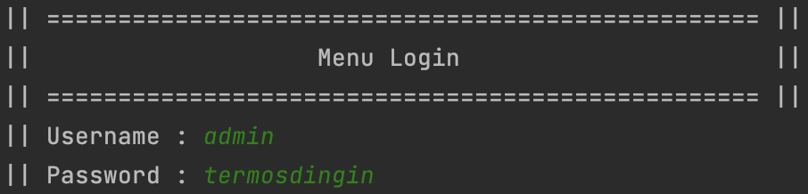Gambar diatas merupakan tampilan dari menu Login. Dapat dilihat pada gambar, menu pengguna akan diminta untuk memasukkan username dan password.

**2) Menu Admin** 
Tampilan awal ketika masuk sebagai admin adalah menu admin. Pada tahap ini, admin dapat melihat restoran, menambah menu restoran, menambah restoran, dan menghapus restoran.
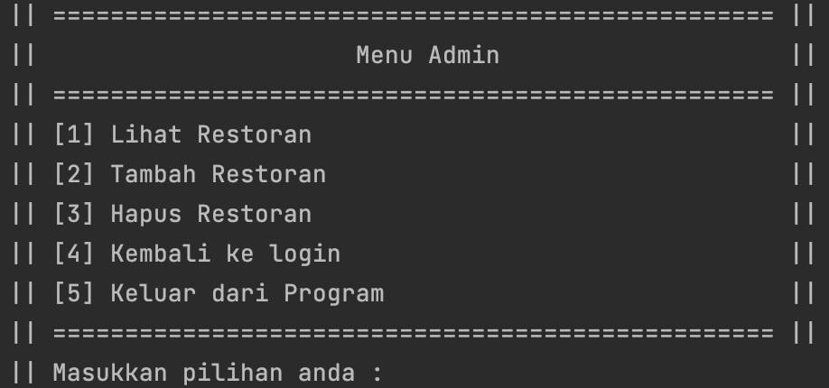Gambar diatas merupakan tampilan dair menu admin. Pada tahap ini, admin dapat menentukan aksi yang akan dilakukannya.

**3) Lihat Restoran** 
Admin dapat melihat restoran-restoran yang dimilikinya. Pada tahap ini, admin juga dapat menambah menu yang terdapat pada restoran yang dimilikinya.
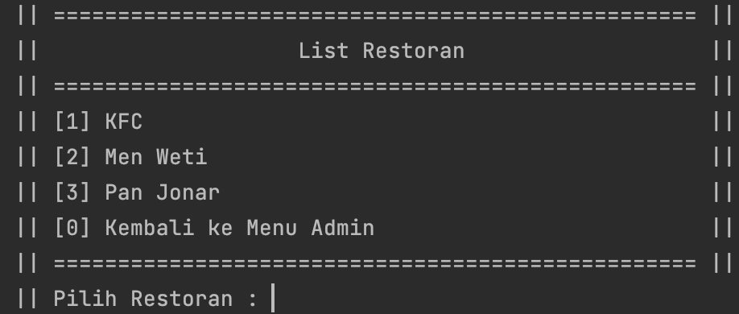 Gambar diatas adalah tampilan saat memilih pilihan lihat restoran. Disini admin dapat melihat semua restoran yang dimilikinya. Selain itu admin juga dapat melihat detail dari restoran dengan memilih pilihan restorannya. Salah satu contoh detail restoran dapat dilihat pada gambar dibawah ini.
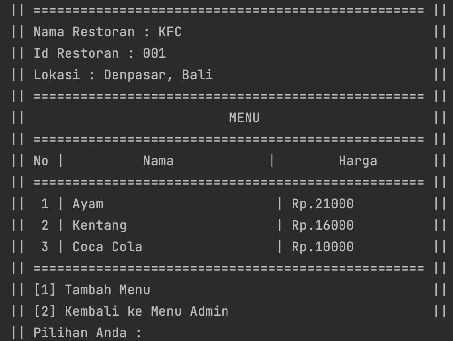 Gambar diatas adalah salah satu contoh tampilan detail restoran. Tampilan tersebut berisi nama restoran di restoran, lokasi, dan menu yang tersedia. Pada tahap ini, admin juga bisa menambah menu dari restorannya.
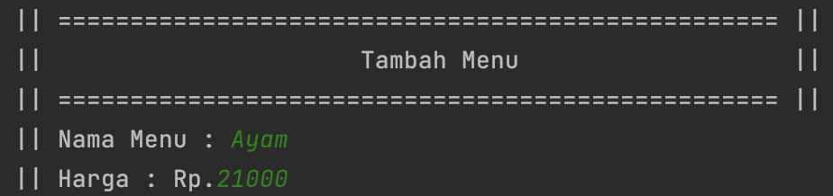 Gambar diatas adalah tampilan setelah memilih menambah menu. Pada tahap ini, admin diminta untuk memasukkan nama menu dan harga dari menu tersebut.

**4) Tambah Restoran** 
Selain melihat restoran, admin juga dapat menambahkan restoran. Pada saat menambah restoran, admin diharuskan untuk menyertakan nama restoran dan lokasi dari restoran. (Note : Id Restoran di-generate secara otomatis).
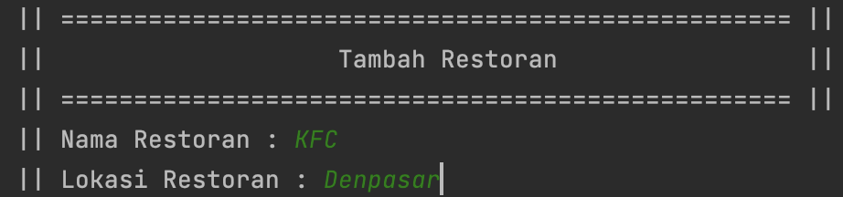 Gambar diatas merupakan tahap dari pilihan tambah restoran. Pada tahap ini, admin diminta untuk memasukkan nama restoran dan lokasi dari restoran(kabupaten/kota di bali, cth : Denpasar, Badung, dll).

**5) Hapus Restoran** 
Pilihan terakhir yang tersedia untuk admin adalah menghapus restoran. Tampilan dari tahap ini dapat dilihat pada gambar dibawah.
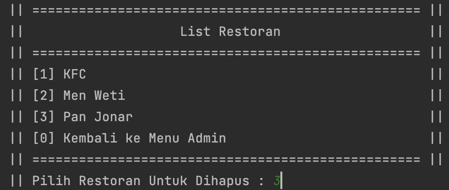Gambar diatas merupakan tahap dari pilihan hapus restoran. Pada tahap ini, admin memilih pilihan restoran mana yang akan dihapusnya.

**6) Intro Customer** 
Tahap pertama saat program berjalan melalui sudut pandang customer adalah intro customer. Pada tahap ini, customer diminta untuk mengisi data diri yaitu nama lengkap dan domisili(kabupaten/kota di bali, cth : Denpasar, Badung, dll).
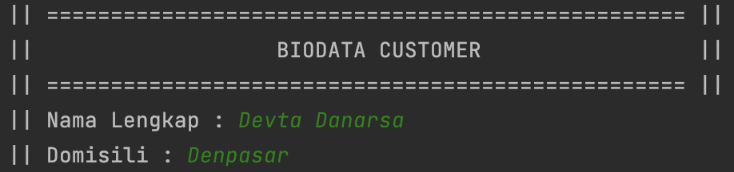

**7) Menu Customer** 
Setelah melalui intro customer, program lalu akan berlanjut dengan menampilkan menu customer. Tampilan dari menu customer dapat dilihat pada gambar dibawah ini.
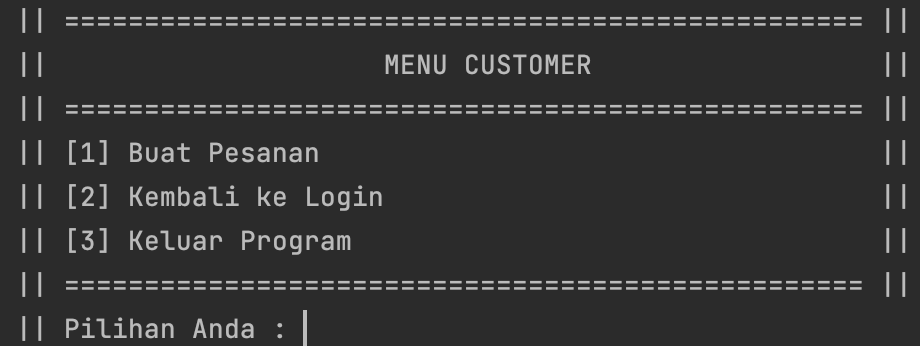 Gambar diatas merupakan tampilan dari menu customer. Pada tahap ini, customer dapat menentukan aksi yang ingin dilakukannya.

**8) Buat Pesanan** 
Fitur utama dari customer adalah membuat suatu pesanan. Awalanya, customer akan diminta untuk memilih akan memesan dari restoran mana.
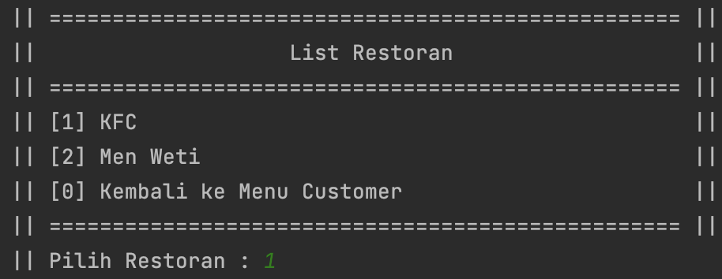
Setelah memilih restoran, customer dapat melihat menu dari restoran yang dipilihnya dapat memilih menu apa yang akan dipesan dan jumlah yang dipesan.
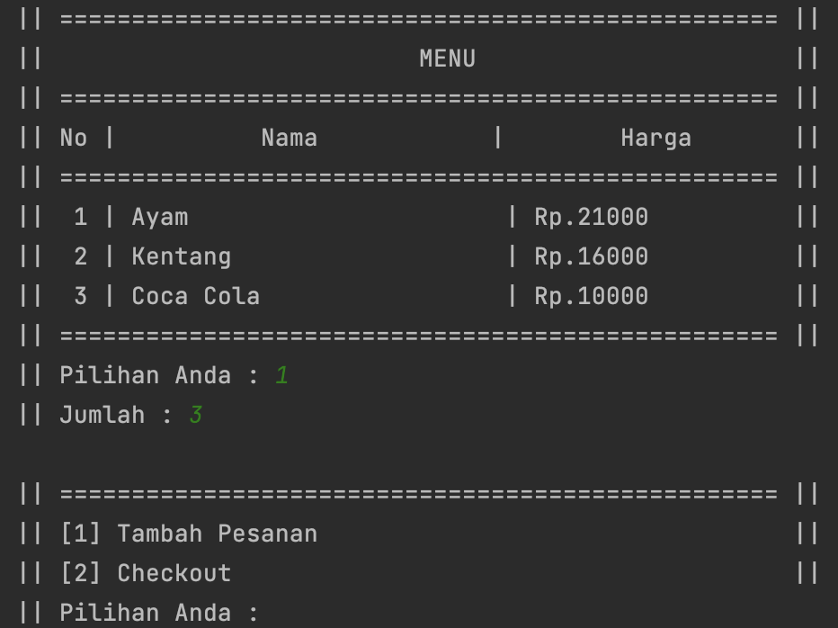
Setelah memilih menu yang akan dipesan,customer juga dapat memilih untuk menambah lagi pesanannya atau melanjutkan ke tahap checkout. Jika customer memilih tambah pesanan, maka akan mengulang proses pada gambar diatas.
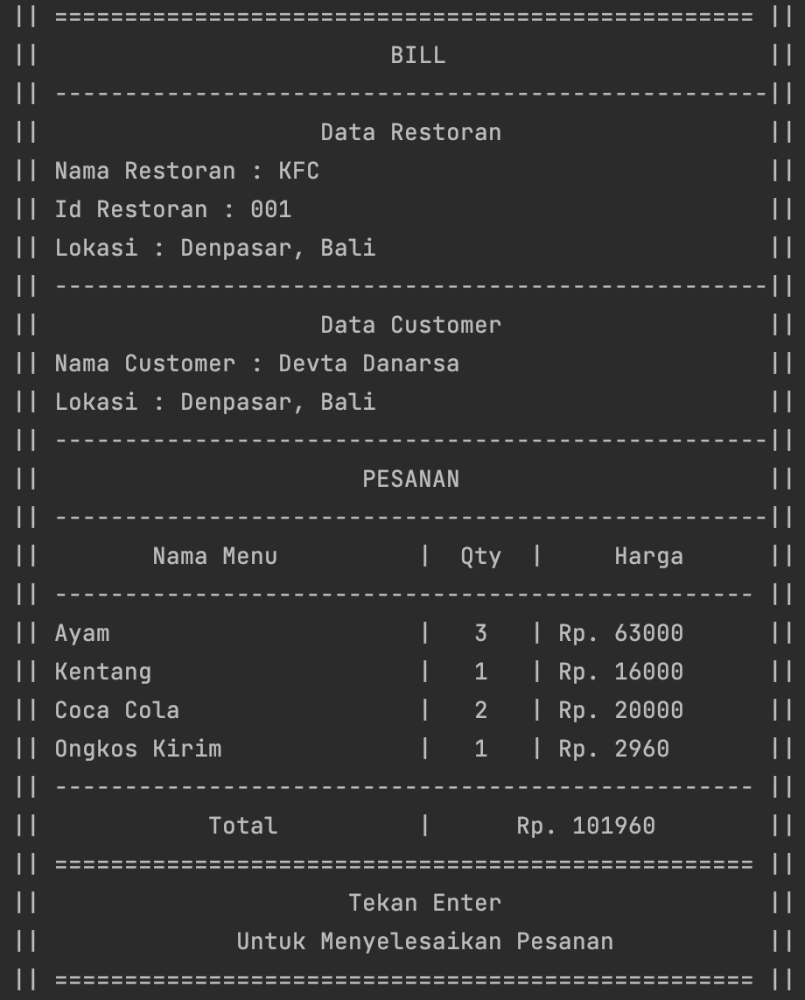
Tampilan diatas adalah tampilan saat checkout suatu pesanan. Data checkout terdiri dari data restoran(nama restoran, id restoran, lokasi), data customer(nama customer dan lokasi), dan jumlah pesanan dari customer tersebut.